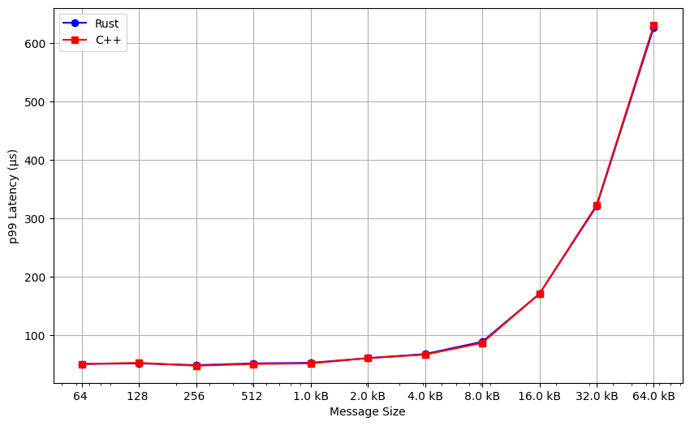

# `msg_gen` Application

This is a simple message generator application that uses the Machnet stack.

## Prerequisites

Before you begin, ensure you have met the following requirements:

- Successful build of the Machnet project (see main [README](../../README.md)).
- A Machnet stack instance must already be running on the machine that needs to use this message generator application.
- You can find information on how to run the Machnet stack in the [Machnet README](../../README.md).

## Building and Running the Application

The `msg_gen` application is built using cargo.

```bash
cargo build --release 
# Alternatively for a debug build,just do
# cargo build
```

 To see the available options, run:

```bash
msg_gen --help
```

To send 64 bytes messages from a client[`10.0.255.110`] to a server[`10.0.255.111`] and receive them back, follow this example:

Run on the server:

```bash
./target/release/msg_gen --local-ip 10.0.255.111 --local-port 1111 --msg-size 64 
```

Run on the client:

```bash
./target/release/msg_gen --local-ip 10.0.255.110 --local-port 1111 --remote-ip 10.0.255.111 --remote-port 1111 --msg-size 64
```

### Benchmark

From 64 bytes to 64KB, we measured the `p99` latency for both Rust and C++ implementations.
The results are as follows:

| Message Size (bytes) | Rust Latency | C++ Latency |
| -------------------- | ------------ | ----------- |
| 64                   |     51       | 51          |
| 128                  |     52       | 53          |
| 256                  |     49       | 48          |
| 512                  |     52       | 51          |
| 1024                 |     53       | 52          |
| 2048                 |     61       | 61          |
| 4096                 |     68       | 67          |
| 8192                 |     89       | 87          |
| 16384                |     171      | 171         |
| 32768                |     321      | 323         |
| 65536                |     627      | 631         |


<!--  -->